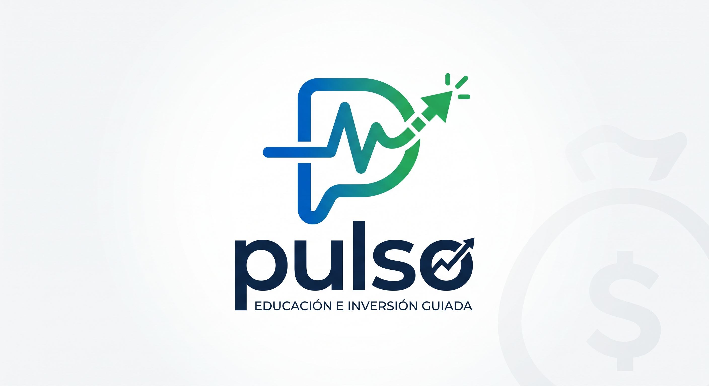

# PULSO — Educación e Inversión Guiada

<div align="center">
  
  <p><strong>Plataforma B2B2C de educación financiera e inversión guiada que activa ahorradores pasivos en Colombia hacia productos regulados.</strong></p>
  <p>
    <a href="https://adminquiros.github.io/Pulso/"><strong>📊 Ver Pitch Deck Web</strong></a> •
    <a href="https://adminquiros.github.io/Pulso/simulador/"><strong>🎮 Probar Simulador Bursátil</strong></a>
  </p>
</div>

---

## 📌 Resumen del Proyecto

**Pulso** resuelve la brecha crítica entre el ahorro pasivo desprotegido frente a la inflación y el acceso a productos de inversión regulados (FICs, CDTs, acciones y renta fija) en Colombia.

A través de interfaces intuitivas, micro-educación contextual y automatización de análisis de mercado, Pulso transforma información financiera compleja en decisiones sencillas y seguras para cualquier persona.

---

## 🌐 Estructura del Ecosistema Web

Este repositorio aloja dos experiencias independientes construidas con estándares web modernos (**HTML5, Vanilla CSS3 y JavaScript ES6+**), sin dependencias de backend ni bases de datos, optimizadas para **GitHub Pages**:

| Módulo | Ruta Local | URL de Producción (GitHub Pages) | Descripción |
| :--- | :--- | :--- | :--- |
| **Pitch Deck Interactivo** | `index.html` | [adminquiros.github.io/Pulso/](https://adminquiros.github.io/Pulso/) | Presentación interactiva de 16 diapositivas estilo Apple/Tesla Keynote para inversionistas. |
| **Simulador Bursátil** | `simulador/index.html` | [adminquiros.github.io/Pulso/simulador/](https://adminquiros.github.io/Pulso/simulador/) | Minijuego gamificado que demuestra cómo las noticias influyen en las acciones de la BVC. |

---

## 🎮 Simulador Bursátil de Noticias

El simulador demuestra de forma práctica, rápida (1-2 minutos) y educativa el valor diferencial de Pulso:

> *"Las noticias influyen en los mercados. Pulso transforma información compleja en señales fáciles de interpretar para cualquier persona."*

### ⚙️ Mecánica de Juego
- **Capital Inicial:** `$100.000 COP`.
- **Rondas:** 6 noticias corporativas reales de empresas colombianas líderes.
- **Toma de Decisión:** El usuario evalúa si la noticia provocará que la acción **⬆ SUBE** o **⬇ BAJA**.
- **Impacto Financiero:**
  - **✅ Respuesta Correcta:** `+$10.000 COP` y tendencia alcista en el gráfico bursátil.
  - **❌ Respuesta Incorrecta:** `-$10.000 COP` y corrección bajista en el gráfico.
- **Feedback Inmediato:** Gráficos animados en **Canvas 2D**, efectos de sonido con **Web Audio API** y tarjeta de **Señal Pulso** explicando la racionalidad de mercado.
- **Nivel Asignado al Final:**
  - `0 - 2 aciertos:` 🔴 **Inversionista Novato**
  - `3 - 4 aciertos:` 🟡 **Analista Junior**
  - `5 aciertos:` 🔵 **Analista Intermedio**
  - `6 aciertos:` 🏆 **Gurú del Mercado**

### 🏢 Casos Empresariales Evaluados
1. **Bancolombia (`BCOL`):** Apertura de 50 nuevos corresponsales bancarios y oficinas digitales (Impacto: **SUBE**).
2. **Ecopetrol (`ECOP`):** Falla temporal en refinería y reducción de producción por dos semanas (Impacto: **BAJA**).
3. **Grupo Nutresa (`NUT`):** Adquisición estratégica de empresa de alimentos saludables en LatAm (Impacto: **SUBE**).
4. **ISA (`ISA`):** Retrasos regulatorios en proyecto de transmisión energética andina (Impacto: **BAJA**).
5. **Grupo Éxito (`EXITO`):** Ventas récord y superación de expectativas durante temporada de descuentos (Impacto: **SUBE**).
6. **Cementos Argos (`ARGOS`):** Incremento sustancial en costos de energía y transporte (Impacto: **BAJA**).

---

## 🎨 Identidad Visual & Diseño

Basado en la paleta institucional oficial de Pulso:
- **Azul Pulso:** `#004DFF` (Color primario de acción y tecnología)
- **Verde Crecimiento / Ganancias:** `#00D27F` / `#00C853` (Rendimientos y señales alcistas)
- **Rojo Pérdidas:** `#FF5252` (Señales bajistas y correcciones)
- **Oro Financiero:** `#D4AF37` (Acentos de patrimonio y métricas clave)
- **Gris Guiado:** `#808080` (Acompañamiento y jerarquía secundaria)
- **Superficies Dark Mode:** Deep Space `#050912`, Card `#161B22` con **Glassmorphism** y tipografía moderna (`Plus Jakarta Sans`, `Inter`, `JetBrains Mono`).

---

## 📂 Estructura de Archivos

```
Pulso/
├── index.html                           # Presentación principal (Pitch Deck)
├── Pulso_Pitch_Deck_Presentacion.html   # Archivo maestro de la presentación
├── README.md                            # Documentación integral del proyecto
└── simulador/
    ├── index.html                       # Markup semántico y accesible del simulador
    ├── styles.css                       # Sistema de diseño FinTech (Mobile-First, Responsive)
    ├── script.js                        # Lógica de simulación, Canvas 2D y Web Audio API
    └── assets/
        ├── logo.png                     # Logo oficial en alta resolución
        └── iconos/                      # Iconos vectoriales de marcas colombianas (SVG)
            ├── bancolombia.svg
            ├── ecopetrol.svg
            ├── nutresa.svg
            ├── isa.svg
            ├── exito.svg
            └── argos.svg
```

---

## 🚀 Despliegue en GitHub Pages

1. Subir los archivos a la rama principal (`main` o `master`) del repositorio:
   ```bash
   git init
   git remote add origin https://github.com/adminquiros/Pulso.git
   git add .
   git commit -m "feat: Simulador Bursátil interactivo e integración con Pitch Deck"
   git branch -M main
   git push -u origin main
   ```
2. En GitHub, ir a **Settings** > **Pages**.
3. En **Build and deployment** > **Source**, seleccionar **Deploy from a branch**.
4. Elegir la rama `main` (o `master`) y la carpeta `/ (root)`.
5. Guardar. En pocos segundos, la presentación estará disponible en `https://adminquiros.github.io/Pulso/` y el simulador en `https://adminquiros.github.io/Pulso/simulador/`.

---

## 👥 Equipo Fundador

- **Juan Diego Valencia R.** — Liderazgo, UX, Investigación de Clientes y Producto.
- **Esteban David Quirós M.** — Modelo de Negocio, Operaciones, Compliance y Alianzas Institucionales.

*Especialización en FinTech — Universidad de La Salle | Emprendimiento e Innovación*
